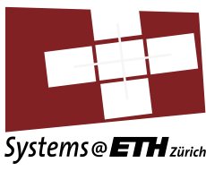

<div align="center">

  
  
# Cloud Computer Architecture
### Spring Semester 2024
### Professor: [Ana Klimovic](https://anakli.inf.ethz.ch)


<a href="#">
    
</a>
<a href="#">
    
</a>
<a href="#">
    
</a>
<br>
<a href="#">
    
</a>
<br>
<a href="https://systems.ethz.ch/education/courses/2024-spring/cloud-computing-architecture.html"><strong>Explore Course Page »</strong></a>
</div>

## Project Description
This project is a part of the course Cloud Computing Architecture at ETH Zurich. The project consists of 4 parts as described below.
## Getting Started
See below each part's description and how to run it.
### Part 1:
This Part focuses on performing a memcached microbenchmark on the cluster with various types of interference. The goal is to understand how different interferences affect cluster performance.
To run the benchmark, sequentially run the following commands, to deploy the cluster, setup the benchmark, run the benchmark and then delete the cluster:
```bash
$ cd part1
$ ./deploy_cluster.sh
$ ./setup_benchmark.sh
$ ./run_benchmark.sh
$ ./delete_cluster.sh
```
Note:
By default, [part1.yaml](part1/part1.yaml) is used to deploy the cluster in `gmanos` bucket. Make sure to change the bucket name to your bucket.

### Running it locally


#### Team Members:
* Aris Koutris, [akoutris@ethz.ch](mailto:akoutris@ethz.ch)
* George Manos,  [gmanos@ethz.ch](mailto:gmanos@ethz.ch)
* Maritina Tsanta, [mtsanta@ethz.ch](mailto:mtsanta@ethz.ch)
